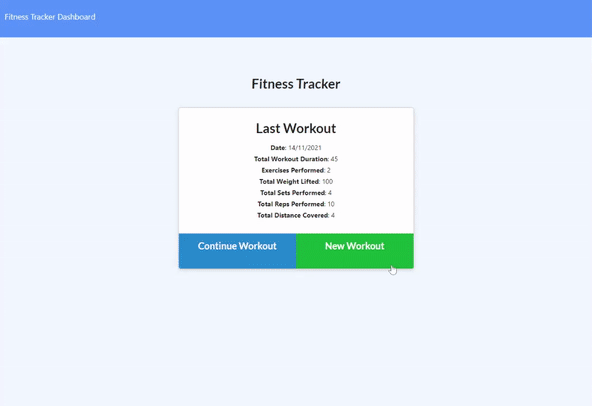
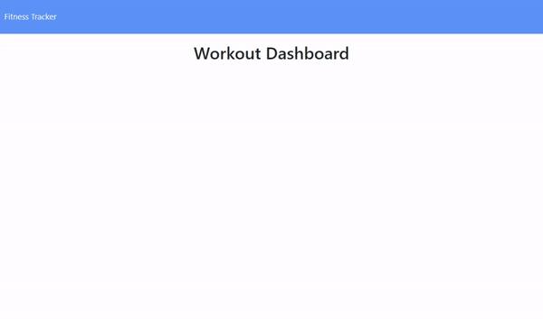

# Fitness Tracker

This is a fitness tracker app that allows for recording daily exercise routines. A user can create a new workout, then add data for any combination of resistance and cardio training exercises.

This data can then be visualized on the dashboard via various charts displaying the user's aggregated exercise totals for workout durations, total weight lifted, etc. over the past seven days.

## Deployed Page

* [See live site here](https://dry-waters-62412.herokuapp.com/).

---

## Getting Started

These instructions will get you a copy of the project up and running on your local machine for development and testing purposes. See deployment for notes on how to deploy the project on a live system.

### Prerequisites

* IDE to view/edit source code (e.g. Visual Studio Code).
* [Node.js](https://nodejs.org/en/).
* [MongoDB](https://www.mongodb.com/).

### Installing

1. Clone repository.
1. Navigate to `fitness-tracker` directory in terminal.
1. `npm install` dependencies.
1. If desired, seed database with `npm run seed`.
1. Run with `npm start`.

### Deployment

1. Upload to webhosting service, such as [Heroku](https://www.heroku.com/).
1. Attach MongoDB hosting service, such as [MongoDB Cloud](https://www.mongodb.com/).

---

## Built With

* [Mongoose](https://www.npmjs.com/package/mongoose)
* [MongoDB](https://www.mongodb.com/)
* [Express.js](http://expressjs.com/)
* [Node.js](https://nodejs.org/en/)

## Author

Vince Lee
- [Portfolio](https://starryblue7.github.io/portfolio-iii/)
- [Github](https://github.com/StarryBlue7)
- [LinkedIn](https://www.linkedin.com/in/vince-lee/)

## License

[MIT License](https://vince-lee.mit-license.org/)

## Acknowledgments

* Data visualization by [Chart.js](https://www.chartjs.org/).
* Database service provided by [MongoDB Cloud](https://www.mongodb.com/).
* Webhosting by [Heroku](https://www.heroku.com/).